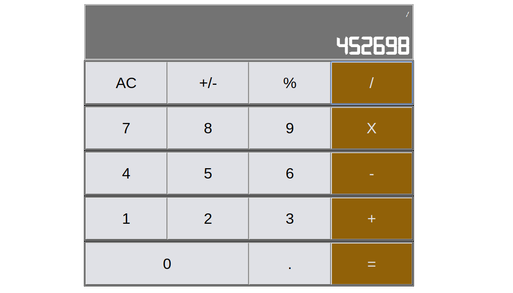

# react-calculator

> A simple app that performs arithmetic operation bases on inputs and symbols

## Table of Contents

- [Live Demo](#live-demo)
- [Background](#background)
- [Built With](#build-with)
- [Prerequisites](#Prerequisites)
- [Install](#install)
- [Deployment](#deployment)
- [Potential Future Feature](#potential-future-feature)
- [Maintainers](#maintainers)
- [License](#license)

## Live Demo

>Live version can be found in [Live](https://minimagic-calculator.netlify.com/) 

## Background
Simple calculator built using React. Management of states are simple and passed from main App component downstream to children components.

## Built With
- Major languages - JavaScript, html5, CSS3
- Frameworks - [React](https://reactjs.org/)

## Prerequisites
- Device must have installed nodejs. You can install it from [here](https://nodejs.org/en/).

## Install

Open terminal and perform the operation sequentially.

1. Clone the repository `git clone git@github.com:shshamim63/react-calculator.git`
2. Get into the repository `cd react-calculator`
3. Install the dependencies on node_module
  - With npm - `npm install`  
  OR
  - With yarn - `yarn install`
4. To start the project `yarn start` or `npm start`
## Deployment
- To create an optimized production(build)
  - With npm - `npm run build`
   OR
  - With yarn - `yarn run build`

## Potential Future Feature

- Improve the current User Interface
- Add more arithmetic operations

## Maintainers
👤 **Shakhawat Hossain**

- Github: [@shshamim63](https://github.com/shshamim63)
- Twitter: [@Shshamim090](https://twitter.com/Shshamim090)
- Linkedin: [shakhawathossainshamim](https://www.linkedin.com/in/shakhawathossainshamim/)

## Contributing
🤝 PRs accepted. 
1. Fork it (https://github.com/shshamim63/react-calculator)
2. Create your feature branch (git checkout -b feature/[choose-a-name])
3. Commit your changes (git commit -am 'what this commit will fix/add')
4. Push to the branch (git push origin feature/[chosen-name])
5. Create a new Pull Request

Small note: If editing the README, please conform to the [standard-readme](https://github.com/RichardLitt/standard-readme) specification.

## Show your support

Give a ⭐️ if you like this project!

Small note: If editing the README, please conform to the [standard-readme](https://github.com/RichardLitt/standard-readme) specification.

## License

MIT © 2019 Shakhawat Hossain
